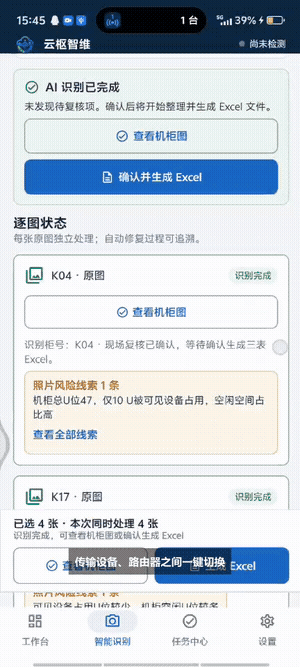
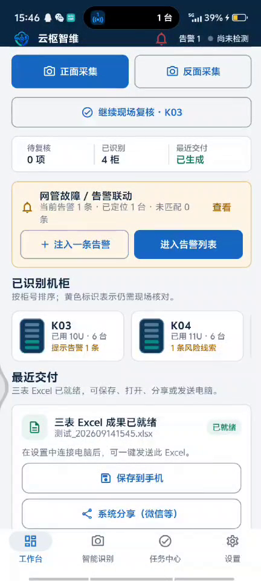
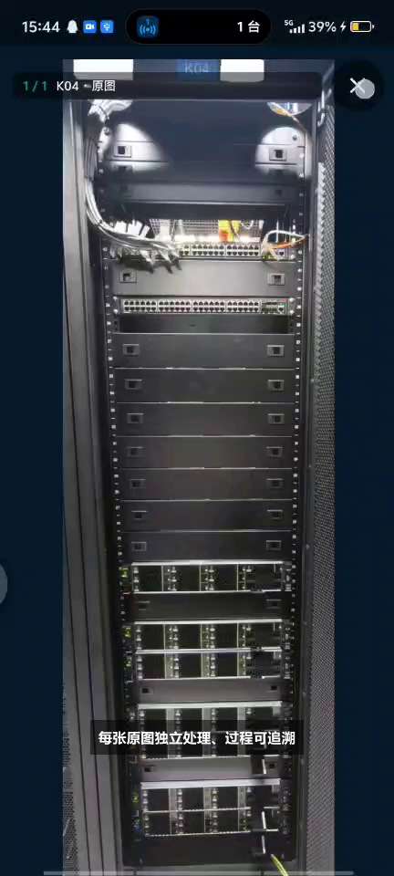
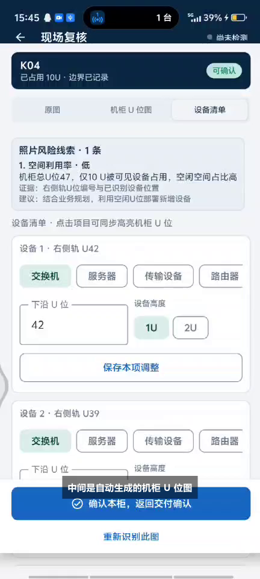
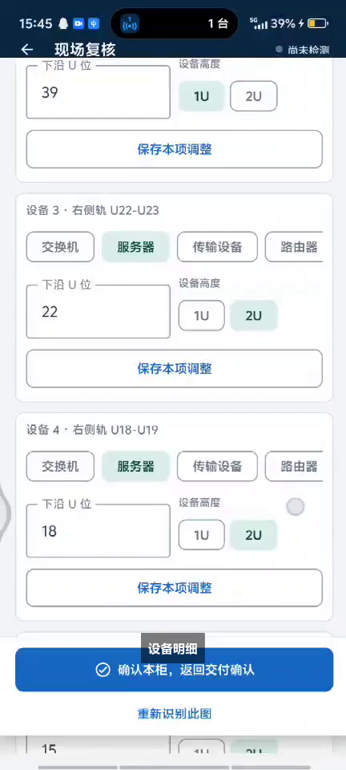
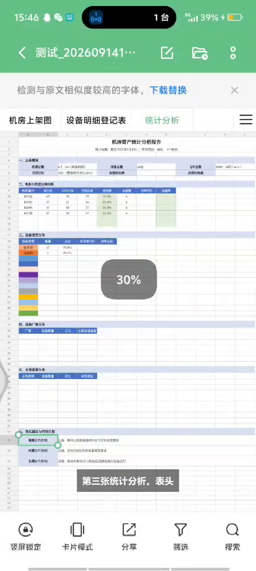
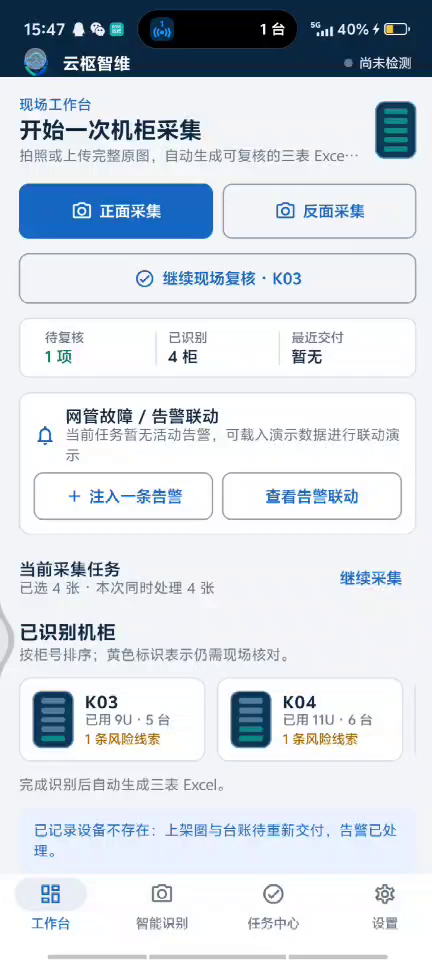
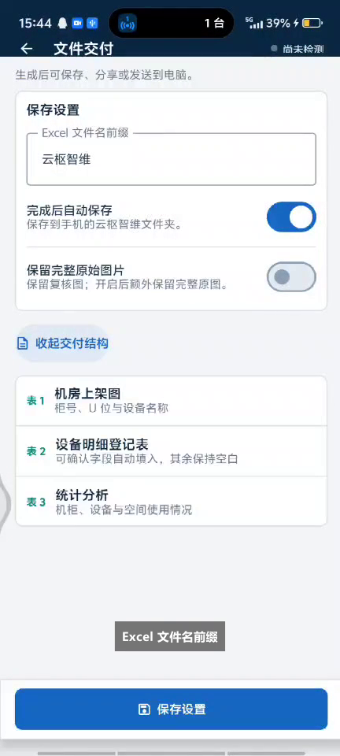
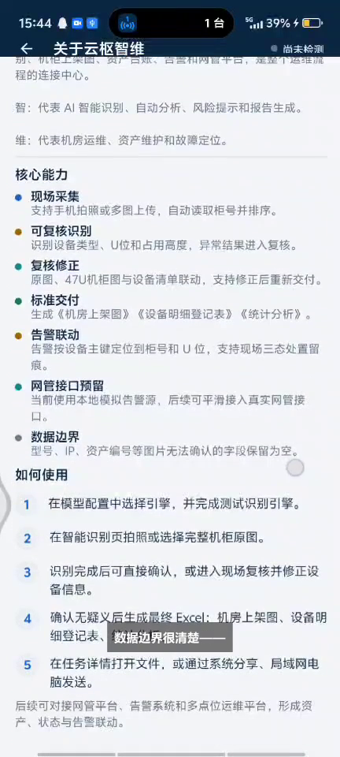

# YunshuOps · 云枢智维

**English** | [简体中文](#简体中文)

> Turn a phone photo of a server rack into a structured Excel deliverable — on-device multi-modal recognition, offline LAN hand-off to your PC, no central server required.

<p align="left">
  <a href="../../releases/latest"></a>
  <a href="../../releases/latest"></a>
  <a href="../../releases/latest"></a>
  <a href="LICENSE"></a>
</p>

## What is this

YunshuOps is a two-piece toolkit for field asset-accounting of telecom equipment rooms:

| Piece | Platform | What it does |
| --- | --- | --- |
| **Android app** (`android/`) | Android 8.0+ | Shoot/upload full front photos of racks → a multi-modal model reads each photo **independently** (no stitching) → results are sorted by rack number → export a 3-sheet `.xlsx` |
| **Desktop receiver** (`desktop-receiver/`) | Windows 10/11 x64 | One-time QR pairing over LAN, chunked resume-safe upload, SHA-256 + ZIP validation, drops the `.xlsx` straight into a folder you choose |

No central server. Phone and PC just need to be on the same LAN.

> **No credentials are bundled.** Every build ships with *empty* model endpoint / model name / API key. You fill in your own OpenAI-compatible endpoint in **Settings → Configurations** on first run.

### Demo



| Field workbench | Rack capture | Independent recognition |
| --- | --- | --- |
|  |  |  |

| On-site review | Device detail review | Three-sheet Excel |
| --- | --- | --- |
|  |  |  |

| Task workbench | File delivery settings | About & capabilities |
| --- | --- | --- |
|  |  |  |

## Features

**Android**
- Field workbench: capture / gallery upload, current task, three-sheet delivery entry.
- Independent per-photo recognition — each original photo is a separate model call, keeping rack numbers and U positions unreconciled across photos.
- Bounded-concurrency with self-repair: default 5 lanes, up to 3 automatic retries per photo, live progress.
- **Review queue**: occlusions, glare and ambiguous U boundaries are surfaced with photo evidence and a concrete suggestion instead of being silently guessed.
- Duplicate-rack de-duplication, keeping the more complete recognition.
- Multiple named model profiles (URL + model + key), encrypted with Android Keystore and shown masked.
- Prompt templates: built-in standard template plus copy/edit/save/delete for your own.
- Excel export of three worksheets, shareable through the system sheet (WeChat, mail, …).
- Alarm-linkage demo: mock alarms are derived from the devices actually recognized in the current task, matched to rack/U position, with rack highlighting and three-state disposition.

**Desktop receiver**
- Tray-resident; closing the window does not stop receiving.
- One-time QR pairing, valid 10 minutes, invalidated after a successful scan.
- Random Bearer token per paired device; only the hash and a DPAPI-encrypted copy are stored.
- Chunked upload (4 MB default) with query-by-chunk resume, per-chunk checksum, whole-file SHA-256 and Excel ZIP structure validation.
- Never overwrites: name collisions become `file (1).xlsx`.
- Recent-20 receipts with source device, target folder and timestamp.
- One-click "allow LAN access" inbound firewall rule, confirmed by an administrator prompt.

## Repository layout

```
yunshu-ops/
├── android/                 # Android app (Kotlin · Compose)
│   └── app/src/main/assets/机柜信息登记图模板.xlsx   # template layout source
├── desktop-receiver/        # Windows receiver (C# · .NET 8 · WPF)
├── docs/
│   ├── architecture.md
│   ├── build.md
│   └── protocol-v1.md       # pairing + chunked upload protocol
├── tools/scan-secrets.sh    # pre-release secret gate
├── assets/                  # screenshots / GIFs used by this README
└── LICENSE                  # GPL-3.0
```

## Quick start

1. Download both artifacts from [Releases](../../releases/latest):
   - `yunshu-android-<version>.apk`
   - `YunshuReceiver-<version>-win-x64.zip` (extract and run, no installer)
2. On the phone: install the APK, then **Settings → Configurations** → create a model profile with *your own* OpenAI-compatible endpoint, model id and key → tap **Test engine** until it reports ready.
3. On the PC: run the receiver, pick a delivery folder, click **Allow LAN access** and accept the Windows prompt.
4. Pair: make sure both are on the same LAN (a phone hotspot works well) and scan the QR code from the app.
5. Shoot a rack photo in the app and generate the three-sheet Excel — it lands in your chosen folder.

Build from source: see [`docs/build.md`](docs/build.md).

## The Excel deliverable

| Worksheet | Auto-filled | Left for humans |
| --- | --- | --- |
| **机房上架图** (rack elevation) | rack count, 47U layout, rack number, U-band map, device names/types, legend, per-rack risk suggestions | physical location, rack power, supply type |
| **设备明细登记表** (device register) | index, rack, U range, device type, visible name/model/vendor/asset fields, evidence | anything not legible in the photo |
| **统计分析** (statistics) | usage rate, type distribution, photo-verifiable vendor distribution, action suggestions | power/current/load figures without a reliable source |

Fields that are not clearly readable in a photo stay **blank** — the pipeline prefers an honest gap over a plausible-sounding guess.

## License

**GNU General Public License v3.0** — see [`LICENSE`](LICENSE).

This license is deliberately **copyleft**: if you build on this project, your derivative work must also be released under GPL-3.0 with its source code available. Shipping a closed-source fork is not permitted.

---

## 简体中文

> 把手机拍的机柜正面照，变成一份结构化 Excel 交付件——端上多模态识别、局域网直传电脑、不依赖中心服务器。

### 这是什么

云枢智维是一套面向通信机房现场资产盘点/交付的两件套工具：

| 组件 | 平台 | 作用 |
| --- | --- | --- |
| **Android App**（`android/`） | Android 8.0+ | 拍摄/上传完整机柜正面图 → 多模态模型**逐图独立识别**（不拼图、不混柜号）→ 按柜号自然排序 → 导出三张工作表的 `.xlsx` |
| **桌面接收器**（`desktop-receiver/`） | Windows 10/11 x64 | 局域网一次性二维码配对、分片断点续传、SHA-256 与 Excel ZIP 结构校验，直接把 `.xlsx` 落到你指定目录 |

手机与电脑同一局域网即可，**不需要中心服务器**。

> **不内置任何真实密钥**：所有构建的模型端点、模型名、API Key **默认为空**。首次使用请在 App 的「设置 → 配置中心」填写你自己的 OpenAI-compatible 端点。

### 核心能力

**Android 端**
- 现场作业工作台：拍照/相册采集、当前任务、三表交付入口优先展示。
- 逐图独立识别：每张原图独立调用模型，不拼接、不混合柜号与 U 位。
- 限流并发与自修复：默认 5 路并发，单图最多自动修复 3 次并展示进度。
- **待复核清单**：遮挡、反光、U 位边界不确定项连同照片证据与处理建议一起列出，而不是硬猜。
- 同柜去重：同一柜号重复上传时保留更完整的一份。
- 多套具名模型配置（URL + 模型 + Key），Android Keystore 加密保存、掩码显示。
- 提示词模板：内置标准模板，支持复制/编辑/保存/删除自定义模板。
- 三张工作表导出，可经系统分享发送到微信、邮件等。
- 告警联动演示：Mock 告警由本次真实识别出的设备动态生成，支持机架高亮与三态现场处置。

**桌面接收器**
- 系统托盘常驻，关窗不停服务。
- 一次性二维码配对，10 分钟有效，配对成功即失效。
- 每台配对设备使用随机 Bearer Token，仅保存哈希与 DPAPI 加密副本。
- 分片上传（默认 4 MB）支持断点续传，逐片校验 + 整文件 SHA-256 + Excel ZIP 结构校验。
- 重名自动改名 `文件 (1).xlsx`，绝不覆盖已有交付件。
- 最近 20 条接收回执（来源设备 / 保存目录 / 接收时间）。
- 一键「启用局域网访问」，由 Windows 管理员确认后创建仅限本程序的入站规则。

### 目录结构

```
yunshu-ops/
├── android/                 # Android App（Kotlin · Compose）
│   └── app/src/main/assets/机柜信息登记图模板.xlsx   # 版式模板来源
├── desktop-receiver/        # Windows 接收器（C# · .NET 8 · WPF）
├── docs/
│   ├── architecture.md      # 架构说明
│   ├── build.md             # 构建说明
│   └── protocol-v1.md       # 配对与分片上传协议
├── tools/scan-secrets.sh    # 发布前泄密闸门
├── assets/                  # 本 README 使用的截图/GIF
└── LICENSE                  # GPL-3.0
```

### 快速开始

1. 从 [Releases](../../releases/latest) 下载两个产物：`yunshu-android-<版本>.apk` 与 `YunshuReceiver-<版本>-win-x64.zip`（解压即用，无需安装）。
2. 手机装 APK → 进入「设置 → 配置中心」新建模型配置，填**你自己的**端点、模型名与 Key → 点「测试识别引擎」直到就绪。
3. 电脑运行接收器，选择交付目录，点「启用局域网访问」并确认 Windows 权限提示。
4. 配对：手机与电脑连同一局域网（用手机热点最稳），在 App 内扫描接收器二维码。
5. 在 App 里拍一张机柜照片并生成三表 Excel，文件即落入你选择的目录。

自行构建见 [`docs/build.md`](docs/build.md)。

### Excel 三表

| 工作表 | 自动填写 | 保留人工补录 |
| --- | --- | --- |
| **机房上架图** | 机柜数量、47U 规格、柜号、U 位图、设备名称/类型、图例、逐柜风险建议 | 物理位置、机柜功率、供电类型 |
| **设备明细登记表** | 序号、机柜编号、U 位范围、设备类型、可见名称/型号/厂商/资产字段、识别依据 | 照片看不清的任何字段 |
| **统计分析** | U 位使用率、设备类型分布、照片可确认的厂商分布、优化行动建议 | 无可靠来源的电力/电流/负载信息 |

照片里看不清的字段**一律留空**——宁可如实留白，也不给一个听起来合理的猜测。

### 许可

**GNU GPL v3.0**（见 [`LICENSE`](LICENSE)）。

该许可为**传染性（copyleft）**：凡基于本项目进行的二次开发，其衍生作品**必须以 GPL-3.0 开源并提供对应源码**，不允许闭源分发。

---

## Contributing

Issues and pull requests are welcome. Before opening a PR, please run:

```bash
bash tools/scan-secrets.sh
```

and make sure it passes — this repository must never contain real credentials, endpoints or customer data.
